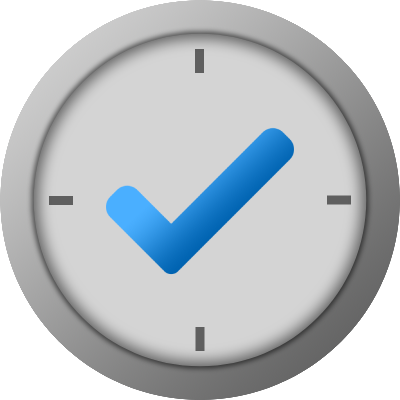
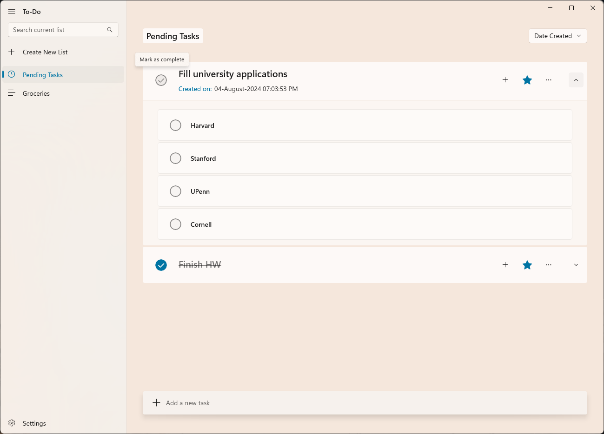
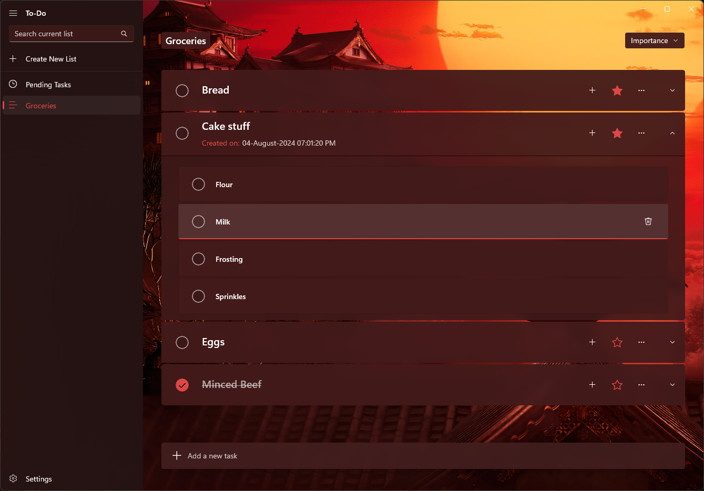
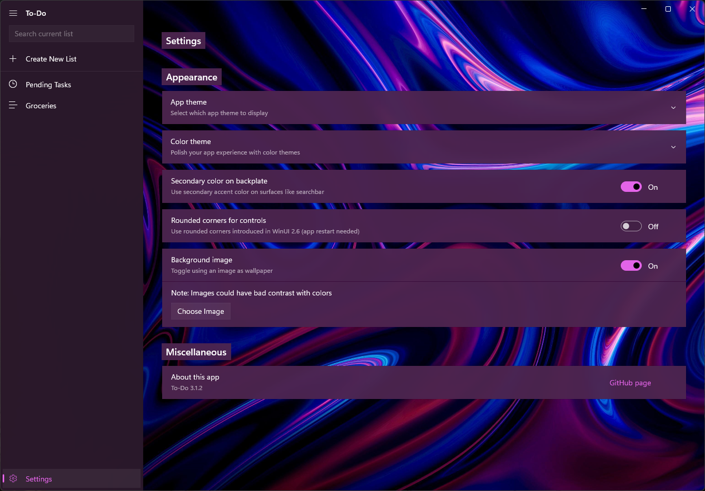

    

<h1 align="center">To-Do</h1>

 

## Purpose
To-Do is an open-source task management app written in C# and XAML and released as a UWP app. It retains some of the nostalgic Microsoft To-Do UI. Still, it has a delightful visual overhaul for both Windows 10 and 11 users, providing a plethora of themes and options to tweak your experience.

Right now there's still lots of stuff to finish. Therefore I always welcome new issues and discussions related to the app.

## Installation
### For normal users
- Search the Microsoft Store for To-Do by FireCubeStudios (thanks to [@FireCubeStudios](https://github.com/FireCubeStudios) for hosting this app on their account).
- Download and install the app (NOTE: Store version might be older than GitHub one. If so, use the below method).
### For advanced users
- Go to the Releases view, and download the zip file of the latest stable (recommended) or pre-release version.
- Unzip the downloaded file, and run the msixbundle file to install it.

## Roadmap
- [ ] \(Pre-release) Fix backup algorithm
- [ ] Populate Task Detail Pane with more information
- [ ] Reduce unnecessary modules and XAML controls
- [ ] Add comments to code for ease of understanding

## Contribution
I look forward to fixing issues pointed out by users. Feel free to fork and experiment with this repository, or star it and be notified of new features. There is a [Discord server](https://discord.com/invite/PsUS2rjCtu) where I have my channel dedicated to this app, and that is where I am active almost all the time. Please feel free to chat and ask for features either there or here.

## Screenshots
<h3 align="center">Pending Tasks</h3>

    

<h3 align="center">Custom Page & Background</h3>

    

<h3 align="center">Settings</h3>

    

